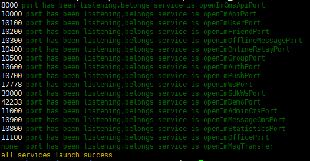

# 源码部署

## 服务器配置

> Linux系统 8G及以上内存   

## 安装组件

> Open-IM-Server依赖五大开源组件：**Etcd**、**MySQL**、**MongoDB**、**Redis**、**Kafka**，在使用源码部署Open-IM-Server 前，请确保五大组件已安装。如果没有安装以上组件，建议使用上文的docker部署。

#### 1.克隆项目

```
git clone https://github.com/OpenIMSDK/Open-IM-Server.git --recursive
(注：如果项目中cmd/Open-IM-SDK-Core这个子模块无法正常拉取，文件夹为空，可前往https://github.com/OpenIMSDK/Open-IM-SDK-Core，获取最新tag，放置于cmd/下，编译即可)
```

#### 2.修改config.yaml，配置五大组件的连接参数

```
cd Open-IM-Server
vim config.yaml
```

- 修改 Etcd 配置项

```
etcd:
  etcdAddr: [ 127.0.0.1:2379 ]
```

- 修改MySQL配置项

```
mysql:
  dbAddress: [ 127.0.0.1:3306 ]
  dbUserName: root
  dbPassword: openIM
```

- 修改MongoDB配置项

```
 mongo:
   dbAddress: [ 127.0.0.1:27017 ]
   dbUserName:
  dbPassword:
```

- 修改 Redis配置项

```
 redis:
  dbAddress: [ 127.0.0.1:6379 ]
  dbPassWord: openIM
```

- 修改 Kafka 配置项

```
kafka:
  ws2mschat:
    addr: [ 127.0.0.1:9092 ]
  ms2pschat:
    addr: [ 127.0.0.1:9092 ]
```

保存config.yaml退出即可。

每种RPC数量默认为1，如果需要调整RPC数量，修改config.yaml中的配置项rpcport对应的port信息，port个数代表对应rpc服务的进程数。比如openImUserPort: [ 10100,10101 ]表示本机会启动两个open_im_user，port分别为10100,10101

#### 3.构建

```
cd Open-IM-server/script
chmod +x *.sh
./build_all_service.sh
```

#### 4.启动

```
./start_all.sh
```

#### 5.检查

```
./check_all.sh
```



如图所示，表示正常启动。

