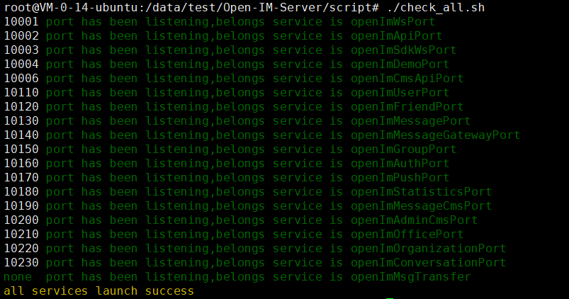

# Docker部署-初次部署

## 服务器配置

> Linux系统，当前可用内存2G及以上

## 安装docker

要求docker版本20.10.14以上，docker-compose版本1.24.1以上

## 一键部署

如果确定是首次安装，可以直接采用如下命令完成1-4步

``` 
git clone https://github.com/OpenIMSDK/Open-IM-Server.git --recursive; cd Open-IM-Server/script ; chmod +x *.sh ; ./env_check.sh;cd .. ; docker-compose up -d;cd script ; ./docker_check_service.sh
```

## 1.克隆 

```
git clone https://github.com/OpenIMSDK/Open-IM-Server.git --recursive
```

## 2.检测环境

```
cd Open-IM-Server/script ; chmod +x *.sh ; ./env_check.sh
```


目前仅支持Linux系统，并且保证当前可用内存在2G以上，系统才能正常运转。在生产环境中，建议可用内存在4G以上。

## 3.拉取&启动

```
cd .. ; docker-compose up -d
```

## 4.检查

```
cd script ; ./docker_check_service.sh
```

****

如图所示，表示正常启动。

## 5.IM开放端口

| IM端口    | 说明                                    | 操作                                |
| --------- | --------------------------------------- | ----------------------------------- |
| TCP:10001（之前的17778端口） | ws协议，消息端口，比如消息发送，推送等。  | 端口放行或nginx反向代理，关闭防火墙 |
| TCP:10002（之前的10000端口）| api端口，比如用户、好友、群组等接口。     | 端口放行或nginx反向代理，关闭防火墙 |
| TCP:10003（之前的30000端口）| ws协议，针对jssdk的专用端口。           | 端口放行或nginx反向代理，关闭防火墙 |
| TCP:10004（之前的42233端口）| demo使用的用户注册登录端口。            | 端口放行或nginx反向代理，关闭防火墙 |
| TCP:10005（之前的9000端口）| 选择minio存储时需要开通。                 | 端口放行或nginx反向代理，关闭防火墙 |
| TCP:10006（之前的8000端口）| 管理后台api端口，需要管理后台服务时开通。 | 端口放行或nginx反向代理，关闭防火墙 |

注：如果使用nginx做反向代理，则只需要开放443端口即可。


## 6.nginx配置

注意修改域名、https证书，以及ip

```
server {
        listen 443;
        server_name open-im-test.rentsoft.cn;

        ssl on;
        ssl_certificate /etc/nginx/conf.d/ssl/open-im-test.rentsoft.cn.crt;
        ssl_certificate_key /etc/nginx/conf.d/ssl/open-im-test.rentsoft.cn.key;

        ssl_session_timeout 5m;

	gzip on;
	gzip_min_length 1k;
	gzip_buffers 4 16k;
	gzip_comp_level 2;
	gzip_types text/plain application/javascript application/x-javascript text/css application/xml text/javascript application/x-httpd-php image/jpeg image/gif image/png;
	gzip_vary off;
	gzip_disable "MSIE [1-6]\.";

        location / {
                proxy_set_header Host $host;
                proxy_set_header X-Real-Ip $remote_addr;
                proxy_set_header X-Forwarded-For $remote_addr;
                proxy_set_header X-NginX-Proxy true;
                root /data/test/Pc-Web-Demo/build/;
                index index.html;
                try_files $uri $uri/ /index.html;
        }
	location /demo {
				proxy_http_version 1.1;
				proxy_set_header Upgrade $http_upgrade;    
				proxy_set_header Connection "Upgrade";    
				proxy_set_header X-real-ip $remote_addr;
				proxy_set_header X-Forwarded-For $remote_addr;
				proxy_pass http://43.128.5.63:10004;

	}
	location /jssdk_gateway {
				proxy_http_version 1.1;
                proxy_set_header Upgrade $http_upgrade;
                proxy_set_header Connection "Upgrade";
                proxy_set_header X-real-ip $remote_addr;
                proxy_set_header X-Forwarded-For $remote_addr;
                proxy_pass http://43.128.5.63:10003;
	}
	location /msg_gateway {
				proxy_http_version 1.1;
                proxy_set_header Upgrade $http_upgrade;
                proxy_set_header Connection "Upgrade";
                proxy_set_header X-real-ip $remote_addr;
                proxy_set_header X-Forwarded-For $remote_addr;
                proxy_pass http://43.128.5.63:10001;
	}
	location /rtc {
                proxy_http_version 1.1;
                proxy_set_header Upgrade $http_upgrade;
                proxy_set_header Connection "Upgrade";
                proxy_set_header X-real-ip $remote_addr;
                proxy_set_header X-Forwarded-For $remote_addr;
                proxy_pass http://43.128.5.63:7880;
        }
	location /user {
                proxy_http_version 1.1;
                proxy_set_header X-real-ip $remote_addr;
                proxy_set_header X-Forwarded-For $remote_addr;
                proxy_pass http://43.128.5.63:10002;

        }
		
	location /group {
                proxy_http_version 1.1;
                proxy_set_header X-real-ip $remote_addr;
                proxy_set_header X-Forwarded-For $remote_addr;
                proxy_pass http://43.128.5.63:10002;

        }
	location /manager {
                proxy_http_version 1.1;
                proxy_set_header X-real-ip $remote_addr;
                proxy_set_header X-Forwarded-For $remote_addr;
                proxy_pass http://43.128.5.63:10002;

        }
	 location /third {
                proxy_http_version 1.1;
                proxy_set_header X-real-ip $remote_addr;
                proxy_set_header X-Forwarded-For $remote_addr;
                proxy_pass http://43.128.5.63:10002;

        }
	location /cms {
                proxy_http_version 1.1;
                proxy_set_header X-real-ip $remote_addr;
                proxy_set_header X-Forwarded-For $remote_addr;
                proxy_pass http://43.128.5.63:10006;

        }
    location ~^/storage {
                 proxy_buffering off;
                 proxy_set_header Host $http_host;
                 rewrite ^/storage/(.*)$ /$1 break;
                 proxy_pass http://43.128.5.63:10005;
           }
}

server {
        listen 80;
        server_name open-im-test.rentsoft.cn;
        rewrite ^(.*)$ https://${server_name}$1 permanent;
}

```


## 7.配置修改

系统默认的第三方服务使用了OpenIM的账号（包括对象存储cos，推送jpush，阿里云短信验证码，qq邮箱验证码），请在config/config.yaml中自行修改。

#### 登录注册配置

```
#是否启动demo，如果自身没有账号体系，设置为true
demoswitch: true
demo:
  #demo对外服务端口，默认即可，需要开放此端口或做nginx转发
  openImDemoPort: [ 10004 ]
  alismsverify: #阿里云短信配置，在阿里云申请成功后修改以下四项，必须修改
    accessKeyId: LTAI5tJPkn4HuuePdiLdGqe7
    accessKeySecret: 4n9OJ7ZCVN1U6KeHDAtOyNeVZcjOuV
    signName: 托云信息技术
    verificationCodeTemplateCode: SMS_226810164
  superCode: 666666 #超级验证码，建议修改掉，收不到短信验证码时可以用此替代
  #  second
  codeTTL: 300
  mail: #仅支持qq邮箱，具体操作参考 https://service.mail.qq.com/cgi-bin/help?subtype=1&id=28&no=1001256 必须修改
    title: "openIM"
    senderMail: "765567899@qq.com"
    senderAuthorizationCode: "gxyausfoevlzbfag"
    smtpAddr: "smtp.qq.com"
    smtpPort: 25   #需开放此端口 出口方向

```

#### 对象存储配置

```
redential: #腾讯cos，发送图片、视频、文件时需要，请自行申请后替换，必须修改
  tencent:
    appID: 1302656840
    region: ap-chengdu
    bucket: echat-1302656840
    secretID: AKIDGNYVChzIQinu7QEgtNp0hnNgqcV8vZTC
    secretKey: kz15vW83qM6dBUWIq681eBZA0c0vlIbe
  minio: #MinIO 发送图片、视频、文件时需要，请自行申请后替换，必须修改。 客户端初始化InitSDK，中 object_storage参数为minio
    bucket: openim
    location: us-east-1
    endpoint: http://127.0.0.1:10005 #minio外网ip 这个ip是给客户端访问的
    endpointInner: http://127.0.0.1:10005 #minio内网地址 如果im server 可以通过内网访问到 minio就可以填写
    endpointInnerEnable: true #是否启用minio内网地址 启用可以让桶初始化，IM server连接minio走内网地址访问
    accessKeyID: user12345
    secretAccessKey: key12345
```

#### 离线推送配置

```
jpns: #极光推送 在极光后台申请后，修改以下四项，必须修改
    appKey: cf47465a368f24c659608e7e
    masterSecret: 02204efe3f3832947a236ee5
    pushUrl: "https://api.jpush.cn/v3/push"
    pushIntent: "intent:#Intent;component=io.openim.app.enterprisechat/io.openim.app.enterprisechat.MainActivity;end"
```

## 8.重启服务

```
docker-compose down; docker-compose up -d
```


# docker部署-更新镜像

## 一键更新

如果本地配置没有任何修改，可以直接采用如下命令完成1-5步

```
docker-compose down ; git checkout main -f ; git pull -f ; docker-compose pull;chmod +x script/*.sh ; docker-compose up -d; cd script ; ./docker_check_service.sh
```

## 1.关闭服务

```
cd Open-IM-Server ; docker-compose down
```

## 2.拉取最新配置文件和脚本文件

```
git pull
```

## 3.拉取新的镜像

```
docker-compose pull
```

## 4.重新启动服务

```
chmod +x script/*.sh ; docker-compose up -d
```

## 5.检查

```
cd script ; ./docker_check_service.sh
```

# 注意事项

## 1.系统和环境

目前只支持Linux系统，其他系统请修改脚本。

可用内存在2G以上，请调用./env_check.sh检测。

## 2.更新

在git pull时，确保拉取了最新的配置，特别是对于改动了本地配置文件的开发者，需重点关注。

## 3.build

尽量不要混合启动，自行build，然后通过docker-compose启动会存在问题。因为docker映射，导致本地二进制文件、配置文件不一致，造成混乱。

## 4.OpenIM测试服务

IP：121.37.25.71/

请大家自己的真实的手机号测试，如果和其他人重复，会被踢下线。

